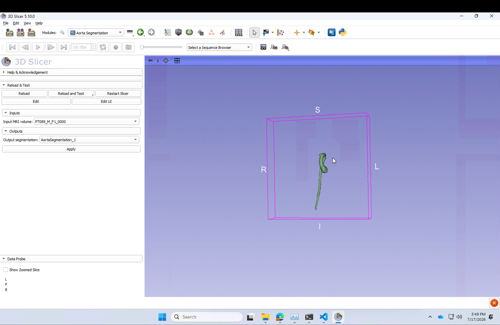

# Aorta Segmentation for 3D Slicer

A [3D Slicer](https://www.slicer.org/) extension that segments the aorta from a single MRI volume using a pretrained nnU-Net v2 model. Select an input volume, click Apply, and get a 3D segmentation back in a few minutes.



Mean validation Dice (fold 0, internal validation set): **0.90**. This is a research tool, not a clinically validated or FDA-cleared product — don't use it for diagnosis.

## Requirements

- [3D Slicer](https://download.slicer.org/) 5.6 or later (developed against 5.10.0)
- Internet connection the first time you run the module (it downloads PyTorch, nnU-Net, and the model weights — a few hundred MB total, one-time)
- Optional: an NVIDIA GPU. The module auto-detects one and installs the matching CUDA build of PyTorch; without a GPU it falls back to CPU, which works but is considerably slower.

## Installation

This extension isn't published in the Slicer Extension Manager yet, so install it manually:

1. Clone this repository:
   ```bash
   git clone https://github.com/esranko1/AortaSegmentationSlicer.git
   ```
2. In Slicer, go to **Edit → Application Settings → Modules**.
3. Under **Additional module paths**, click **Add** and select the `AortaSegmentation/AortaSegmentation` folder inside the cloned repo (the inner one, containing `AortaSegmentation.py`).
4. Restart Slicer when prompted.
5. The module appears under the **Segmentation** category in the module dropdown, named **Aorta Segmentation**.

## Usage

1. Load your MRI volume into Slicer (drag and drop, or **File → Add Data**).
2. Open the **Aorta Segmentation** module.
3. Under **Inputs**, select your MRI volume as the **Input MRI volume**.
4. Under **Outputs**, select or create a segmentation node for the **Output segmentation**.
5. Click **Apply**.
6. First run only: you'll be prompted to confirm downloading dependencies (PyTorch + nnU-Net) and the model weights. Approve this — it only happens once.
7. The status label shows progress while inference runs (typically a few minutes; longer on CPU). When done, a segment named **Aorta** appears in your output segmentation node, with a 3D surface generated automatically.

### Notes

- Only one volume is processed per run.
- The model expects a single-channel MRI volume; other modalities or multi-channel input aren't supported.
- If dependency installation fails, check your internet connection and available disk space, then click Apply again — it retries the same check.

## How the model was trained

The nnU-Net model behind this extension (custom trainer + a clDice-based topology-aware loss for preserving vessel connectivity) was trained in a separate repo: [Aorta-seg](https://github.com/esranko1/Aorta-seg), which covers data preprocessing, training, and postprocessing/QC.

## Acknowledgments

Segmentation is powered by [nnU-Net v2](https://github.com/MIC-DKFZ/nnUNet), not original work of this extension — please cite:

> Isensee, F., Jaeger, P. F., Kohl, S. A. A., Petersen, J., & Maier-Hein, K. H. (2021). nnU-Net: a self-configuring method for deep learning-based biomedical image segmentation. *Nature Methods*, 18(2), 203-211. https://doi.org/10.1038/s41592-020-01008-z

nnU-Net is licensed under the Apache License 2.0. The custom trainer in [`Resources/nnUNetCustomCode/nnUNetTrainerAorta.py`](AortaSegmentation/AortaSegmentation/Resources/nnUNetCustomCode/nnUNetTrainerAorta.py) subclasses it, and its `do_split()` method is a modified copy of nnU-Net's own — see the notice at the top of that file, [`LICENSE-3RD-PARTY`](LICENSE-3RD-PARTY) (nnU-Net's Apache 2.0 license, verbatim), and [`NOTICE`](NOTICE).

The training loss also uses a clDice topology-preservation term:

> Shit, S., Paetzold, J. C., et al. (2021). clDice: A Novel Topology-Preserving Loss Function for Tubular Structure Segmentation. *CVPR 2021*.

## Repository structure

```
AortaSegmentation/
├── CMakeLists.txt                          # extension-level build config
└── AortaSegmentation/
    ├── AortaSegmentation.py                # module UI + logic
    ├── CMakeLists.txt                      # module-level build config
    ├── Resources/
    │   ├── Icons/                          # module icon
    │   ├── UI/                             # Qt Designer form
    │   └── nnUNetCustomCode/               # custom trainer + loss, copied into
    │                                       #   the installed nnunetv2 package at
    │                                       #   inference time so the model loads
    ├── Scripts/run_inference.py            # out-of-process inference entry point
    └── Testing/                            # smoke test
```

## License

[MIT](LICENSE)
